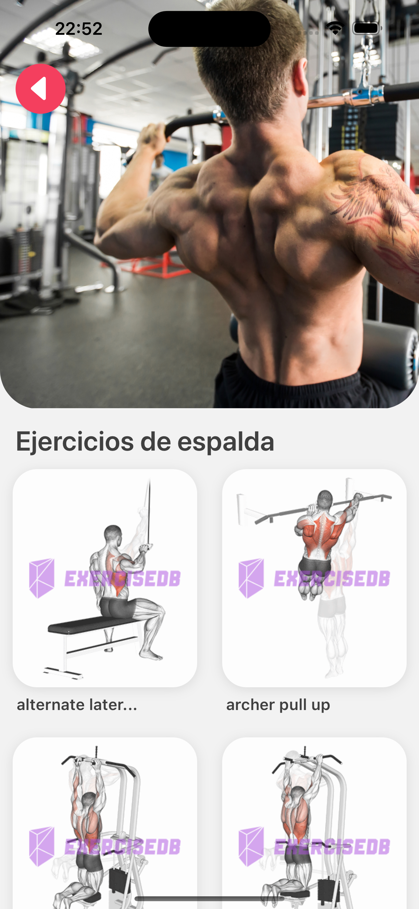
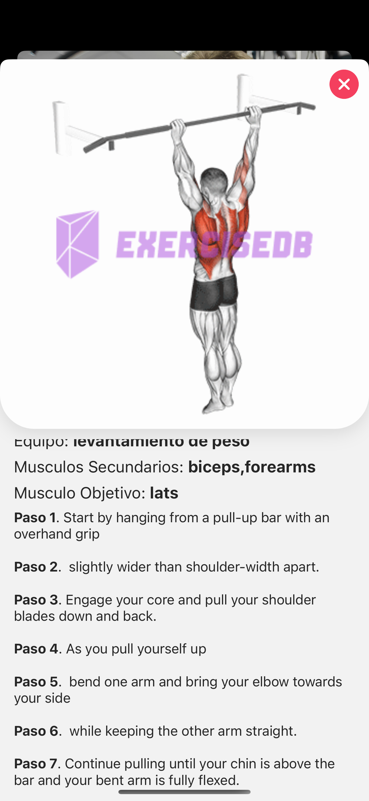

# App de rutinas para Gym

Aplicación de ejercicios para gimnasios y usuarios.

## Descripción

Esta aplicación de React Native con Expo ofrece ejecución de ejercicios para gimnasios, a través de una interfaz intuitiva y fácil de usar.
Ideal para usuarios que buscan seguir y personalizar sus rutinas.


## Características

- Splash Screen personalizada
- Imagenes libres de Derechos
- Muestra de Ejercicios completo en formato GIF
- Iconografía completa
- Diseño minimalista y enfocado en el usuario
- APP router
- Base libre para personalizar acorde al uso

## Capturas de Pantalla






## Instalación

Sigue estos pasos para instalar y ejecutar la aplicación localmente:

1. Clona el repositorio:
   ```bash
   git clone https://github.com/tu_usuario/tu_repositorio.git
2. Navega al directorio del proyecto:
    ```bash
    cd tu_repositorio
3. Instala las dependencias:
    ```bash
    npm install
4. Inicia la aplicación:
    ```bash
    npm start


# Uso
- Escanea el código QR en Expo Go (iOS o Android) para visualizar la aplicación.
- Navega por las rutinas y selecciona una para visualizar los ejercicios.
- Disfruta de una experiencia fluida en cualquier dispositivo.


# Tecnologías Utilizadas
* React Native
* Expo
* TailwindCSS
* Iconografía: React Native Vector Icons


# Contribuciones

Las contribuciones son bienvenidas. Si deseas contribuir, sigue estos pasos:

1. Haz un fork del repositorio.
Crea una rama nueva:
    ```bash
    git checkout -b mi-nueva-funcionalidad
2. Realiza tus cambios y haz un commit:
    ```bash
    git commit -m "Agregada nueva funcionalidad X"
3. Envía un pull request.


Licencia
Este proyecto está bajo la Licencia MIT - mira el archivo [LICENSE](/assets/LICENSE.md) para más detalles.

# Contacto
Nombre: Pablo Ramos
LinkedIn: https://www.linkedin.com/in/pabloramos07/
Sitio web: https://pabloramos.uy